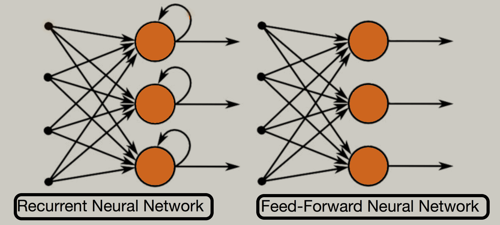
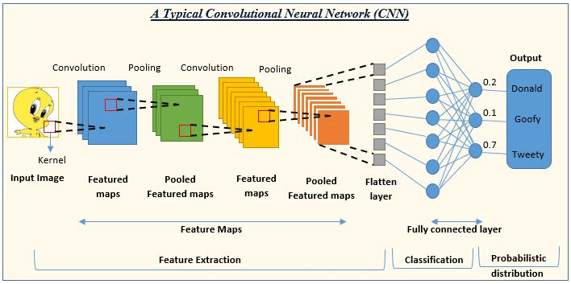

# 09-10-2024 NNFL - Overview of Neural Networks

## What are Neural Networks?

Neural Networks work like a human brain with three main layers.

- Input layer
- Hidden layer
- Output Layer

There are various types of NN - CNN, RNN , Perceptron etc.
They are a subset of machine learning models inspired by the human brain. They are designed to recognize patterns and make the required calculations to find the desired output.

## Why Neural Networks or Deep Learning instead of Machine Learning?

We mostly use NN for unstructured data. We use it instead of Machine Learning since we run into provlems with Sparsity when dealing with such data using Machine Learning.

## What are links?

The connection between nodes is called as a link.

## What is an activation function?

Function used for scaling or normalizing values to a particular range.
It has two roles: 
The first role of activation function is during the hidden layer for scaling or normalizing values and when used in the output layer, it is used to get the desirable output.
Example: softmax function, sigmoid function, ReLu, tanh

## What is an ANN?

ANNs are **computational models** designed to simulate the way human brains process information. They consist of layers of interconnected nodes (artificial neurons).

Warren McCulloch and Walter Pitts introduced the concept of ANNs in 1943.

## Structure of ANNs

### Input Layer 
Receives the initial data. Each represents an input featuer.

### Hidden Layers 
Intermediate layers wehre computation and pattern extraction occurs.

### Output Layer
Productes the final result or prediction.

## Neurons and Connections:

### Weights
Parameters that transform the input data which are adjusted during training to minimize error.

### Biases
Additional parameters to adjust the output along with the weights.

### Activation Functions
Functions used to determine whether a neuron should be activated. 
ex. Sigmoid, Tanh, RELU, softmax.

### Learning Rate

It is used to handle the speed of optimizing and finding the local minima.

### Epoch

Epoch refers to the number of iterations.

## Loss Function

We use the loss function to find the accuracy of the model

## Types of ANNs

### Feedforward Neural Networks
Structure : information moves forward in one direction - input -> output without any backtracking

### Recurrent Neural Networks

Structure: Their connections form directed cycles, allowing them to maintain a memory of previous inputs.

### Convolutional Neural Networks

- It is designed specifically for processing structured grid data like images. They use convolutional layers to automatically and adaptively learn spatial hierarchies of features.
- Its key components include convolutional layers, pooling layers and fully connected layers
- It is used for dealing with image data or videographical data. The purpose of choosing CNN instead of normal or simple deep feed forward neural network is to reduce the image size without losing any kind of information from the image.

## Applications of ANN

- Natural Language Processing
- Object Detection
- Facial Recognition
- Medical Imaging Diagnostics
- Language Translation
- Sentiment Analysis
- Chatbots / Virtual Assistants
- Autonomous Vehicles
- Decision Making

## Learning Process in ANN

### Supervised Learning

Supervised learning involves training the network on a labeled dataset, where each inpput is paired with a correct output. The network learns to map inputs to the correct outputs by minimizing the difference between its predictions and the actual outputs.

**Steps**

1, Dataset Preparation
2. Initialization
3. Forward Propogation
4. Loss calculations5. Backpropogation
6. Weight Update
7. Iteration

### Unsupervised Learning

Unsupervised Learning involves training the network on an unlabeled dataset The network identifies patterns and structures in the data without predefined labels.

**Steps**

1. Dataset Preparation
2. Initialization
3. Forward Propogation
4. Clustering/ Dimensionality Reduction
5. Iteration

### Reinforcement Learning

It involves training the network through interactions with an environment. It learns to perform actions that maximize cumulative rewards.

**Steps**

1. Environment Setup
2. Initialization3. Action Selection
4. Reward Feedback
5. Policy Update
6. Iteration

